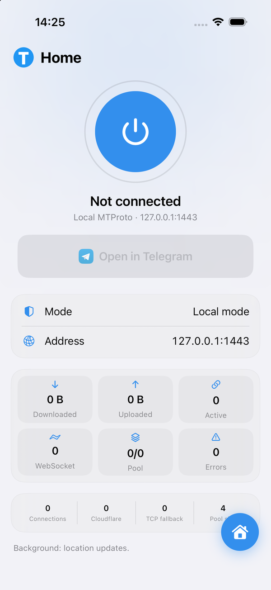
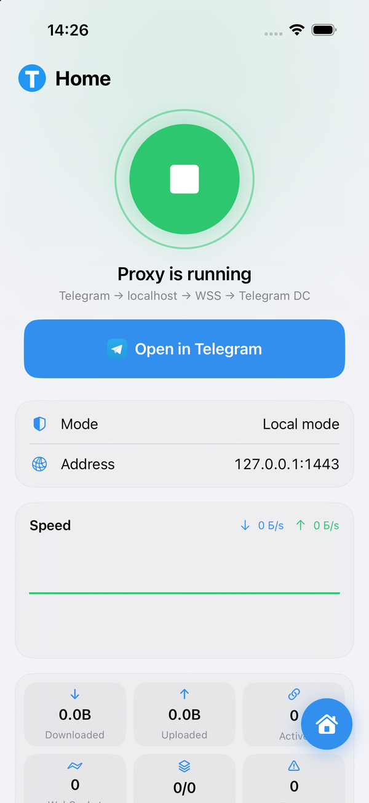
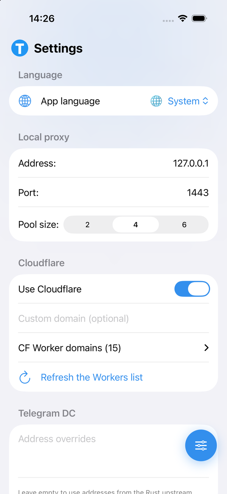

<h1 align="center">TG WS Proxy iOS</h1>

<h4 align="center">Локальный MTProto-прокси для Telegram на iPhone: Rust-ядро, WebSocket-транспорт и работа в фоне без платного Apple Developer.</h4>

<p align="center">
  <a href="docs/README.md">English 🌐</a>
</p>

<p align="center">
  <a href="LICENSE"></a>
  
  
  
</p>

---

**TG WS Proxy iOS** поднимает MTProto-прокси прямо на телефоне и отдаёт Telegram локальный адрес:

```text
Telegram → 127.0.0.1:1443 → Rust-ядро → WSS / Cloudflare → Telegram DC
```

Поддерживается **iOS 16.0 – 27.0**.

> [!CAUTION]
> Это экспериментальный сетевой инструмент. Используйте на свой риск: приложение не проходило аудит безопасности.

---

## 📱 Как выглядит

<p align="center">
  
  
  
</p>

<p align="center"><sub>Главный экран · прокси в работе со статистикой · настройки</sub></p>

---

## 📥 Установка

### 1. Скачайте файл

Со [страницы релизов](https://github.com/reekeer/tg-ws-proxy-ios/releases/latest) — там же подробное сравнение:

| Файл | Кому |
|------|------|
| `TgWsProxy-free.ipa` | **всем, кто не уверен.** Ставится с любым Apple ID |
| `TgWsProxy-vpn.ipa` | только с платным Apple Developer или TrollStore — нужен entitlement Network Extension |

### 2. Установите на iPhone

<details>
<summary><b>Sideloadly</b> — Windows или Mac, кабель, бесплатный Apple ID</summary>

1. Поставьте [Sideloadly](https://sideloadly.io) на компьютер, на Windows он попросит iTunes и iCloud с сайта Apple, не из Microsoft Store.
2. Подключите iPhone кабелем и разрешите доверие компьютеру.
3. Перетащите `.ipa` в окно Sideloadly, введите Apple ID и нажмите Start.
4. Если у аккаунта включена двухфакторная аутентификация, понадобится [пароль для приложения](https://account.apple.com).

</details>

<details>
<summary><b>iLoader</b> — компьютер и кабель, альтернатива Sideloadly</summary>

1. Поставьте iLoader на компьютер.
2. Подключите iPhone кабелем и разрешите доверие компьютеру.
3. Укажите скачанный `.ipa`, войдите под своим Apple ID и запустите установку.

Интерфейс заметно меняется от версии к версии — ориентируйтесь на подсказки внутри программы. Ограничения те же, что у Sideloadly: бесплатный аккаунт, 7 дней, три приложения.

</details>

<details>
<summary><b>AltStore / SideStore</b> — обновляет подпись само</summary>

1. Установите AltStore по [инструкции с сайта](https://altstore.io) (нужен AltServer на компьютере в той же сети) или SideStore, если компьютера под рукой не будет.
2. В самом AltStore выберите **+** и укажите скачанный `.ipa`.

Плюс в том, что подпись продлевается автоматически, пока телефон в одной сети с компьютером, — вручную переустанавливать раз в неделю не нужно.

</details>

<details>
<summary><b>TrollStore</b> — навсегда, без переустановки раз в 7 дней</summary>

Работает только на уязвимых версиях iOS — проверьте свою в [списке совместимости TrollStore](https://ios.cfw.guide/installing-trollstore/). Если версия подходит, откройте `.ipa` в TrollStore и установите.

Подпись не истекает, поэтому это единственный способ, где приложение не отвалится через неделю. Здесь же заработает `TgWsProxy-vpn.ipa`.

</details>

<details>
<summary><b>Xcode</b> — собрать и поставить самому, нужен Mac</summary>

```sh
git clone --recurse-submodules https://github.com/reekeer/tg-ws-proxy-ios
cd tg-ws-proxy-ios
rustup target add aarch64-apple-ios
open TgWsProxy.xcodeproj
```

В Xcode откройте таргет **TgWsProxy → Signing & Capabilities**, выберите свою команду и поменяйте Bundle Identifier на любой свой — чужой идентификатор Xcode подписать не даст. Дальше подключите iPhone, выберите его в списке устройств и нажмите Run.

</details>

> [!NOTE]
> На бесплатном Apple ID подпись живёт **7 дней**, потом приложение перестаёт открываться и его нужно установить заново. Одновременно на аккаунте может быть не больше трёх таких приложений.

### 3. Разрешите работу в фоне

После первого запуска откройте **Настройки iOS → TG WS Proxy → Геопозиция** и выберите **«Всегда»**.

Без этого iOS замораживает прокси через несколько секунд после того, как вы свернёте приложение, и Telegram уходит в «Connecting…». Геопозиция нужна только чтобы система не выгружала процесс — координаты никуда не отправляются.

Если приложение ставилось не через Xcode, iOS сначала попросит доверять сертификату: **Настройки → Основные → VPN и управление устройством** → ваш Apple ID → «Доверять».

### 4. Подключите Telegram

Откройте приложение, нажмите кнопку включения и затем **«Открыть в Telegram»** — прокси добавится сам. В Telegram останется подтвердить подключение.

---

## ⚙️ Как это работает

Rust-ядро поднимает MTProto-прокси на `127.0.0.1:1443` внутри приложения. Telegram подключается к нему как к обычному прокси, а ядро уводит трафик наружу через WebSocket — к серверам Telegram напрямую или через Cloudflare Worker, с откатом на обычный TCP, если WebSocket недоступен.

Наружу это выглядит как обычный HTTPS к Cloudflare и `*.web.telegram.org`.

Чтобы прокси не умирал при сворачивании, приложение подписывается на обновления геопозиции: для iOS процесс выглядит как активная навигация и не приостанавливается. Расплата — заметно более быстрый расход батареи. В сборке `TgWsProxy-vpn.ipa` вместо этого используется системный VPN-туннель, который iOS держит сама.

Подробный разбор — [docs/ARCHITECTURE.ru.md](docs/ARCHITECTURE.ru.md).

---

## 🛠 Сборка из исходников

Нужны Xcode и Rust с таргетом `aarch64-apple-ios`:

```sh
./build.sh                  # TgWsProxy-free.ipa
./build.sh --vpn            # TgWsProxy-vpn.ipa
./build.sh --sim --install  # запустить в симуляторе
```

Rust-ядро приходит из [amurcanov/tg-ws-proxy-android](https://github.com/amurcanov/tg-ws-proxy-android) сабмодулем и раз в неделю подтягивается автоматически отдельным workflow.

---

## 🧬 Происхождение и благодарности

- [Flowseal/tg-ws-proxy](https://github.com/Flowseal/tg-ws-proxy) — исходная идея обхода блокировок через WebSocket и первая версия ядра.
- [amurcanov/tg-ws-proxy-android](https://github.com/amurcanov/tg-ws-proxy-android) — Rust-ядро и Android-версия, используются как upstream.
- [Adolfsmikler](https://github.com/Adolfsmikler) — фоновая работа на бесплатном Apple ID. Предложил и довёл до рабочего состояния удержание процесса через CoreLocation вместо аудио-хаков, благодаря чему прокси остаётся включённым после сворачивания приложения, а также настроил облачную сборку IPA в GitHub Actions.

---

## 🤖 AI Disclaimer

> [!NOTE]
> Часть сборочных скриптов, патчей под свежие версии Xcode и настройка CI/CD писались в соавторстве с нейросетями. За скрытые ошибки, утечки памяти Rust-ядра и будущие поломки авторы ответственности не несут.
